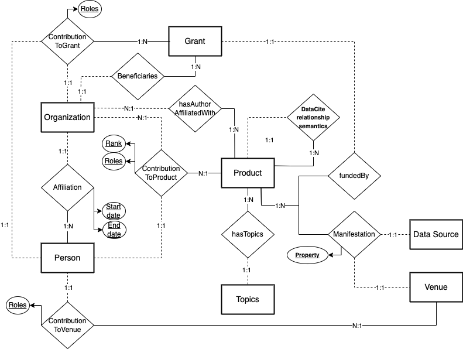

Core model entities
###################

.. note::
   TODO 
      - expand introduction and descriptions
      - double-check consistency of the documentation
      - check provided examples
      - provide an example package serialising an ensamble of connected entities (e.g., for one paper)
      - expand protocols section
   

SKG-IF core entities and relevant relations are reported in the figure below.

.. toctree::
   :maxdepth: 3

   products
   persons
   organisations
   venues
   datasources
   grants
   topics
    